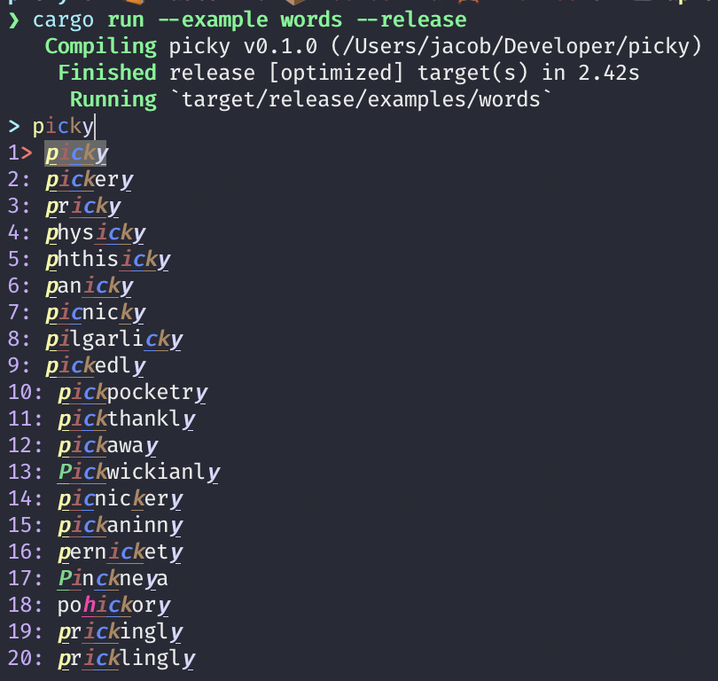
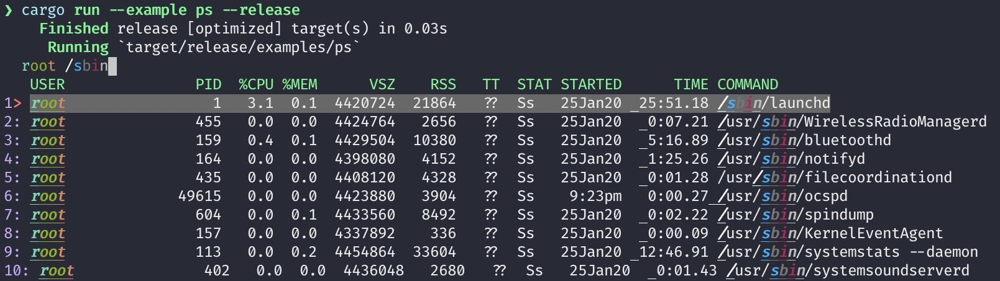
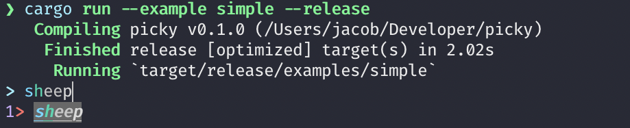

# picky

cross platform command line fuzzy selection library. like fzf and skim but with less features.

heavy wip

## examples

`cargo run --example words --release`

- words

- ps

- simple

## todo

- make turning off colors possible
- choose nicer random colors
- cleanup / refactor
- fix selection going off bounds
- builder pattern
- test on Windows
- handle spaces properly
- improve query editing
